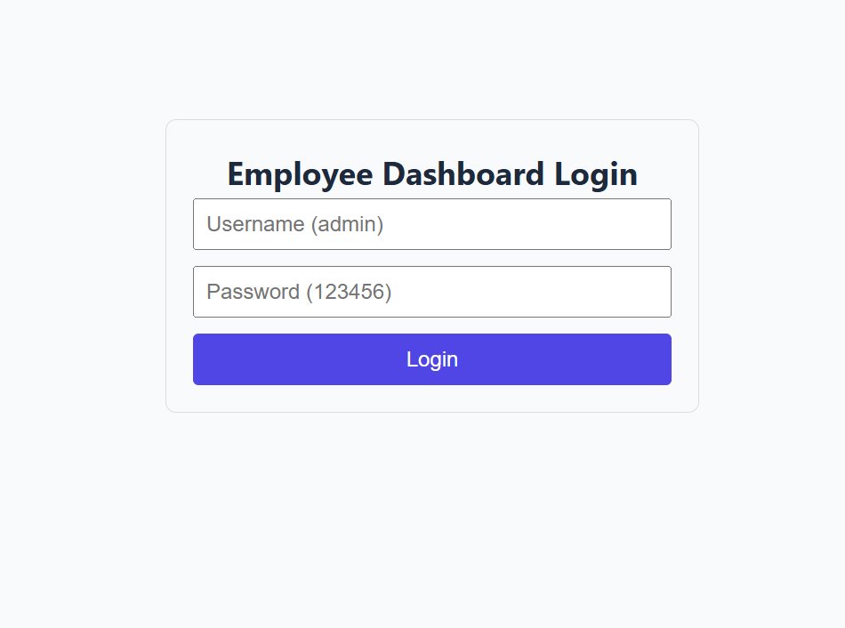
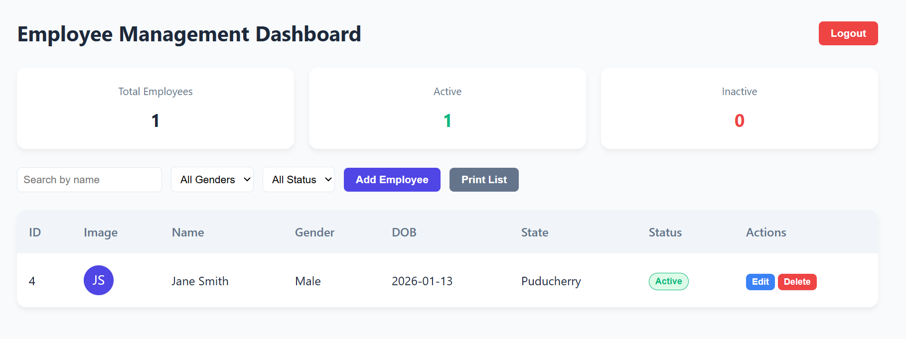

# 📋 Employee Management Dashboard — Detailed README

A modern, feature-rich **Employee Management Dashboard** built with **React.js**, designed for assignments, portfolios, or demo purposes. Includes authentication, CRUD operations, real-time filtering, image upload, and print functionality — all with a clean, responsive UI.

Live Url: https://raspy-rain-f952.shyamsha06012002.workers.dev/


---

## 🌟 Features

| Category | Features |
|--------|--------|
| **Authentication** | ✅ Mock login (`admin` / `123456`) <br> ✅ Persistent login (survives refresh) <br> ✅ Protected routes |
| **Employee Management** | ✅ Add / Edit / Delete employees <br> ✅ Real-time summary cards (Total, Active, Inactive) <br> ✅ Auto-incremented employee IDs |
| **User Experience** | ✅ Profile image upload (Base64, persists on reload) <br> ✅ Attractive skeleton placeholder → dummy avatar fallback <br> ✅ Form validation (name, state, DOB in past only) |
| **Search & Filter** | 🔍 Search by name <br> 🔘 Filter by gender & status <br> 🔄 Combined filtering (search + gender + status) |
| **Print / Export** | 🖨️ `window.print()` support <br> 📄 PDF-friendly output (only ID, Image, Name, DOB, Gender, Status, State) |
| **UI/UX** | 🎨 Modern, clean design <br> 📱 Fully responsive (mobile, tablet, desktop) <br> ⚠️ Confirmation dialogs (logout, delete) |

---

## 🛠 Tech Stack

| Layer | Technology |
|------|-----------|
| **Framework** | React.js (JavaScript, no TypeScript) |
| **Routing** | React Router DOM v6 |
| **State Management** | React Context API + `useState`/`useEffect` |
| **Data Persistence** | `localStorage` (no backend required) |
| **Styling** | Custom CSS with modern design principles |
| **Image Handling** | Base64 encoding (for persistence) + `ui-avatars.com` fallback |
| **Validation** | Custom validation logic (DOB must be in past) |

> 💡 **No external dependencies** beyond `react-router-dom`.

---

## ▶️ How to Run Locally

### Prerequisites
- Node.js (v16 or higher)
- npm or yarn

### Steps

1. **Clone the repository**
   ```bash
   git clone https://github.com/Shyam06102/employee-dashboard.git
   cd employee-dashboard
   ```

2. **Install dependencies**
   ```bash
   npm install
   # or
   yarn install
   ```

3. **Start the development server**
   ```bash
   npm start
   # or
   yarn start
   ```

4. **Open in browser**
   - App runs on: [http://localhost:3000](http://localhost:3000)
   - **Login credentials**:
     - **Username**: `admin`
     - **Password**: `123456`

5. **(Optional) Build for production**
   ```bash
   npm run build
   ```

---

## 🔐 Authentication Flow

1. User lands on **Login Page**
2. Enters valid credentials (`admin` / `123456`)
3. App saves `auth-token` in `localStorage`
4. Redirects to **Dashboard**
5. On refresh:
   - `AuthProvider` checks `localStorage`
   - Restores login state → **stays logged in**
6. **Logout**:
   - Requires confirmation dialog
   - Clears `localStorage`
   - Redirects to login

> ✅ No accidental logouts on refresh.

---

## 🧾 Data Model (Employee)

Each employee object stored in `localStorage`:

```js
{
  id: 1,                      // Auto-incremented (last ID + 1)
  fullName: "John Doe",       // Required
  gender: "Male",             // "Male" or "Female"
  dob: "1990-05-15",          // Past date only (ISO format)
  state: "California",        // Required
  status: true,               // true = Active, false = Inactive
  imageUrl: "data:image/..."  // Base64 string (or empty)
}
```

---

## 🖼️ Image Handling

- **Upload**: User selects image → converted to **Base64 string**
- **Persistence**: Base64 stored in `localStorage` → survives refresh
- **Fallback**: If no image, shows **initials-based avatar** from [ui-avatars.com](https://ui-avatars.com)
  - Example: `John Doe` → `JD` on purple background
- **Print**: Renders correctly in PDF via `window.print()`

> ⚠️ Base64 is used for **demo purposes only** (not suitable for production with large images).

---

## 📏 Validation Rules

| Field | Rule |
|------|------|
| **Full Name** | Required, non-empty |
| **State** | Required, non-empty |
| **Date of Birth** | Required, must be **strictly in the past** (not today or future) |
| **Profile Image** | Optional |

Validation runs on form submit. Errors display below each field.

---

## 🖨️ Print Functionality

- Click **"Print List"** button
- Browser print dialog opens
- Output includes **only**:
  - ID
  - Profile Image
  - Full Name
  - Date of Birth
  - Gender
  - Status (Active/Inactive)
  - State
- **Excluded**: Actions buttons, search bar, summary cards
- **PDF Save**: Use "Save as PDF" in print dialog

> ✅ Controlled entirely via CSS `@media print`.

---

## 📱 Responsive Design

| Screen Size | Behavior |
|------------|--------|
| **Desktop** | Full table, horizontal layout |
| **Tablet** | Stacked controls, readable table |
| **Mobile** | Controls become vertical stack, table scrolls horizontally |

Tested on:
- Chrome, Firefox, Safari
- iOS Safari, Android Chrome

---

## 🗂 Project Structure

```
src/
├── components/
│   └── Dashboard/       # Dashboard UI components
│       ├── EmployeeForm.jsx
│       ├── EmployeeTable.jsx
│       └── SummaryCard.jsx
├── context/
│   └── AuthContext.jsx  # Auth state & logic
├── pages/
│   ├── DashboardPage.jsx
│   └── LoginPage.jsx
├── services/
│   └── employeeService.js  # localStorage CRUD
├── utils/
│   └── validation.js       # Form validation
├── App.js
├── index.js
└── styles.css              # Global styles + print media
```

---

## 🧪 Testing Checklist

✅ **Authentication**
- [ ] Login with valid credentials → dashboard
- [ ] Refresh dashboard → stays logged in
- [ ] Logout → confirmation → redirects to login

✅ **Employee CRUD**
- [ ] Add employee → appears in table with correct ID
- [ ] Edit employee → updates instantly
- [ ] Delete → confirmation → removed from list
- [ ] Toggle status → summary counts update in real-time

✅ **Validation**
- [ ] DOB in future → error
- [ ] Empty name/state → error
- [ ] Valid data → saves successfully

✅ **UI/UX**
- [ ] Image upload → preview + persists on reload
- [ ] No image → shows "JD"-style avatar
- [ ] Mobile view → usable layout

✅ **Print**
- [ ] Click "Print" → only 7 columns visible
- [ ] Save as PDF → clean output

---

## 📝 Assumptions & Design Decisions

| Decision | Reason |
|--------|--------|
| **`localStorage` for data** | No backend needed; sufficient for assignment |
| **Base64 images** | Simple persistence; avoids blob URL expiry |
| **ui-avatars.com fallback** | Professional-looking initials; no local assets |
| **Context API (not Redux)** | Lightweight; avoids unnecessary complexity |
| **CSS-only print control** | No extra libraries; standard web practice |
| **Mock login** | Focus on dashboard logic, not auth security |

---

## 🚀 Deployment

Deploy instantly on:

- **[Netlify](https://netlify.com)**: Drag & drop `build` folder
- **[Vercel](https://vercel.com)**: `git push` → auto-deploy
- **GitHub Pages**: Use `gh-pages` package

Example Netlify deploy command:
```bash
npm run build
# Then drag `build/` folder to Netlify dashboard
```